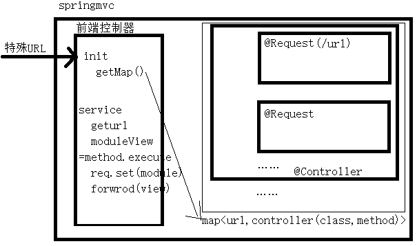
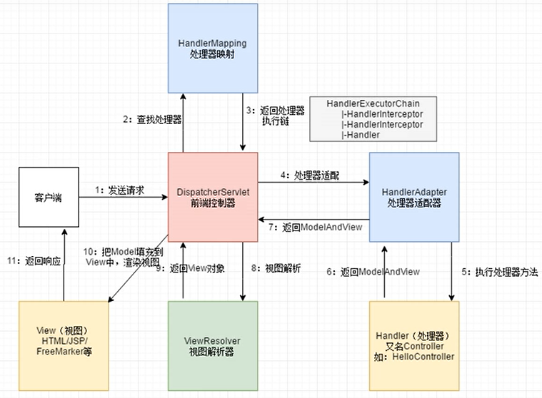
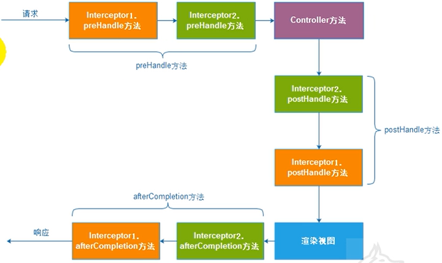

# 分支情况

## 一、spring5 分支

​	分支中有spring容器源码的学习了解笔记

​	标签springv0.1：完成 ioc、di、aop的基础操作例子

​	标签springv0.2：了解spring容器的一些例子

# 知识点

## 一、SpringMVC前端控制器粗略执行流程

### 1、源码学习过程来源

[Java大神之路系列](https://www.bilibili.com/video/av33077376?p=9)

### 2、流程图





1、前端控制器DispatcherServlet

框架提供，接收请求，处理响应结果，转发器，中央处理器

2、处理器映射器HandlerMapping

框架提供，根据请求URL，找到对应的Handler

3、处理器适配器HandlerAdapter

框架提供，调用处理器(Handler/Controller)的方法

4、处理器Handler(Controller)，后端控制器

开发，必须按照HandlerAdapter的规范开发。接收用户请求数据，调用业务方法处理请求。

5、视图解析器ViewResolver

框架提供，把逻辑视图名称解析成真正的物理视图。

6、视图View

开发，把数据展示给用户。

### 3、源码

#### 前端控制器（主要）

```java
public abstract class FrameworkServlet extends HttpServletBean implements ApplicationContextAware {
    protected final void processRequest(request,response){
        doService(request, response);
    }
}
public class DispatcherServlet extends FrameworkServlet {
    HandlerExecutionChain mappedHandler;
    @Override
    protected void doService(HttpServletRequest request, HttpServletResponse response) throws Exception {
        doDispatch(request, response);
    }
    @Override
    protected void doDispatch(HttpServletRequest request, HttpServletResponse response) throws Exception {
        HandlerExecutionChain mappedHandler = null;
        try {
            ModelAndView mv = null;
            try {
                //检查是否是文件上传请求
                processedRequest = checkMultipart(request);
                // 拦截链
                mappedHandler = getHandler(processedRequest);
            }
            // 控制器
            HandlerAdapter ha = getHandlerAdapter(mappedHandler.getHandler());
            // 方法
            String method = request.getMethod();
            // 前置拦截器
            if (!mappedHandler.applyPreHandle(processedRequest, response)) {
                return;
            }
            // 执行controller逻辑
            mv = ha.handVle(processedRequest, response, mappedHandler.getHandler());
            // 获取ViewAndModle对象
            applyDefaultViewName(processedRequest, mv);
            //渲染前拦截器
            mappedHandler.applyPostHandle(processedRequest, response, mv);
            //处理分发请求，渲染ViewAndModle对象
            processDispatchResult(processedRequest, response, mappedHandler, mv, dispatchException);
            //渲染后拦截器 interceptor afterCompletion()
       }
    }
    @Nullable
    protected HandlerExecutionChain getHandler(HttpServletRequest request) throws Exception {
        HandlerMapping mapping;
        HandlerExecutionChain handler = mapping.getHandler(request);
    }
    private void processDispatchResult(HttpServletRequest request, HttpServletResponse response,
      @Nullable HandlerExecutionChain mappedHandler, @Nullable ModelAndView mv,
      @Nullable Exception exception) throws Exception {
        //渲染
        render(mv, request, response);
    }
    protected void render(ModelAndView mv, HttpServletRequest request, HttpServletResponse response) throws Exception {
        view = resolveViewName(viewName, mv.getModelInternal(), locale, request);
        //模型数据装到视图中
        view.render(mv.getModelInternal(), request, response);
    }
}
```

#### 处理器映射

```java
public abstract class AbstractHandlerMapping extends WebApplicationObjectSupport
      implements HandlerMapping, Ordered, BeanNameAware {
    @Override
    @Nullable
    public final HandlerExecutionChain getHandler(HttpServletRequest request) throws Exception {
        Object handler = getHandlerInternal(request);
        HandlerExecutionChain executionChain = getHandlerExecutionChain(handler, request);
    }
}
public abstract class AbstractUrlHandlerMapping extends AbstractHandlerMapping implements MatchableHandlerMapping {
    @Override
    @Nullable
    protected Object getHandlerInternal(HttpServletRequest request) throws Exception {
        String lookupPath = getUrlPathHelper().getLookupPathForRequest(request);
        Object handler = lookupHandler(lookupPath, request);
    }
    @Nullable
    protected Object lookupHandler(String urlPath, HttpServletRequest request) throws Exception {
        // Direct match?
        Object handler = this.handlerMap.get(urlPath);
    }
}
```

#### 控制器适配器

```java
public class SimpleControllerHandlerAdapter implements HandlerAdapter {
    @Override
    @Nullable
    public ModelAndView handle(HttpServletRequest request, HttpServletResponse response, Object handler)
          throws Exception {
        //执行处理器
        return ((Controller) handler).handleRequest(request, response);
    }
}
```

#### 视图器

```java
public abstract class AbstractView extends WebApplicationObjectSupport implements View, BeanNameAware {
    @Override
    public void render(@Nullable Map<String, ?> model, HttpServletRequest request,
      HttpServletResponse response) throws Exception {
        Map<String, Object> mergedModel = createMergedOutputModel(model, request, response);
        prepareResponse(request, response);
        renderMergedOutputModel(mergedModel, getRequestToExpose(request), response);
    }
    /**model中的数据渲染到view中*/
    protected void exposeModelAsRequestAttributes(Map<String, Object> model,
    HttpServletRequest request) throws Exception {
    }
}
public class InternalResourceView extends AbstractUrlBasedView {
    @Override
    protected void renderMergedOutputModel(
    Map<String, Object> model, HttpServletRequest request, HttpServletResponse response) throws Exception {
        exposeModelAsRequestAttributes(model, request);
        rd.forward(request, response);
    }
}
```

#### 拦截链

```java
public class HandlerExecutionChain {
    private final Object handler;
    @Nullable
    private HandlerInterceptor[] interceptors;
    @Nullable
    private List<HandlerInterceptor> interceptorList;
}
```



## 二、Spring数据校验

### 1、资料

[使用spring validation实现对Restful请求的数据进行校验](https://blog.csdn.net/hry2015/article/details/79572713?depth_1-utm_source=distribute.pc_relevant.none-task&utm_source=distribute.pc_relevant.none-task)

[使用校验框架validation校验](https://blog.csdn.net/u012373815/article/details/72049796)

[Spring官网介绍](https://docs.spring.io/spring/docs/5.0.16.RELEASE/spring-framework-reference/core.html#validation-introduction)

### 2、一些注解

|限制|说明|
|:---|:---|
|@Null	|限制只能为null|
|@NotNull	|限制必须不为null|
|@AssertFalse	|限制必须为false|
|@AssertTrue	|限制必须为true|
|@DecimalMax(value)	|限制必须为一个不大于指定值的数字|
|@DecimalMin(value)	|限制必须为一个不小于指定值的数字|
|@Digits(integer,fraction)	|限制必须为一个小数，且整数部分的位数不能超过integer，小数部分的位数不能超过fraction|
|@Future	|限制必须是一个将来的日期|
|@Max(value)	|限制必须为一个不大于指定值的数字|
|@Min(value)	|限制必须为一个不小于指定值的数字|
|@Past	|限制必须是一个过去的日期|
|@Pattern(value)	|限制必须符合指定的正则表达式|
|@Size(max,min)	|限制字符长度必须在min到max之间|
|@Past	|验证注解的元素值（日期类型）比当前时间早|
|@NotEmpty	|验证注解的元素值不为null且不为空（字符串长度不为0、集合大小不为0）|
|@NotBlank	|验证注解的元素值不为空（不为null、去除首位空格后长度为0），不同于@NotEmpty，@NotBlank只应用于字符串且在比较时会去除字符串的空格|
|@Email	|验证注解的元素值是Email，也可以通过正则表达式和flag指定自定义的email格式|