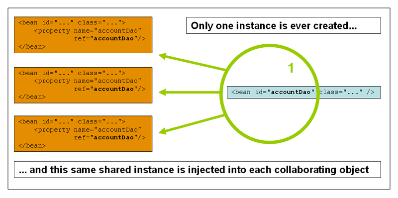

# spring5知识点

## 一、spring5 bean 

### 1、bean的实例化

#### xml

* bean 构造器
* factorybean 工厂bean创建 bean。

> 练习例子creatbean包中，例子结果

``` shell
cn.yuanyuan.createbean._constructor.CatC@33afa13b
cn.yuanyuan.createbean._factorybean.CatB@7a4ccb53 //factorybean默认不是单例
cn.yuanyuan.createbean._factorybean.CatB@309e345f
```

#### 注解

[ioc注解文档](https://docs.spring.io/spring/docs/5.1.13.RELEASE/spring-framework-reference/core.html#beans-classpath-scanning)

```xml
<!--ioc注解解析器-->
<context:component-scan base-package="cn.yuanyuan.annotation"/>
```

@Component 组件

​		@Service 逻辑层组件

​		@Repository 数据持久层组件

​		@Controller 控制层组件

### 2、bean的作用范围

> 生命周期注解 @Scope

#### singleton



> 默认情况下是单例模式

#### prototype


### 3、bean的生命周期

#### 生命周期详情(待补充)


#### 初始化方法和销毁方法

> 练习例子在lifycycle包中，例子配置

```xml
<bean id="cat" class="cn.yuanyuan.lifecycle.bean.Cat"
          init-method="init" destroy-method="destroy"/>
```

> 注解
>
> ​	@PostConstruct 构造函数之后
>
> ​	@PreDestroy对象销毁时

例子结果

```she
constructor
init method
eat something
destroy method
```

## 二、spring5 ID

### 1、xml配置

> 实例例子在di.xml包下

#### xml自动装配(一般不使用)

``` xml
<bean id="dog" class="cn.yuanyuan.di.xml.bean.Dog"/>
<!--
autowire
	default：不自动注入依赖，默认
	byName：根据id或name
	byType：根据类型
	constructor：根据构造器
-->
<bean id="person" class="cn.yuanyuan.di.xml.bean.Person" autowire="default"/>
```

#### setter方法(属性)

``` java
public class Dog {
}
public class Person {
    private Dog pet;
    private String name;
    private int age;

    public void setPet(Dog pet) { this.pet = pet; }
    public void setName(String name) { this.name = name; }

    public void setAge(int age) { this.age = age; }

    @Override
    public String toString() {
        return "Person{" +
                "pet=" + pet +
                ", name='" + name + '\'' +
                ", age=" + age +
                '}';
    }
}
@Data
public class CollectionBean {
    private Set<String> set;
    private List<String> list;
    private String[] array;
    private Map<String,Object> map;
    private Properties properties;
}
```

``` xml
<bean id="dog" class="cn.yuanyuan.di.xml.bean.Dog"/>
<!-- 注入对象和普通类型 -->
<bean id="person" class="cn.yuanyuan.di.xml.bean.Person">
    <property name="name" value="yuanyuan"/>
    <property name="age" value="20"/>
    <property name="pet" ref="dog"/>
</bean>
<!-- 注入集合对象 -->
<bean id="collectionBean" class="cn.yuanyuan.di.xml.bean.CollectionBean">
    <!-- 注入集合类型 -->
    <property name="set">
        <set>
            <value>set1</value>
            <value>set2</value>
            <!--<bean>注入对象-->
        </set>
    </property>
    <!-- list注入列表 -->
    <property name="list">
        <list>
            <value>list1</value>
            <value>list2</value>
            <!--<bean>注入对象-->
        </list>
    </property>
    <!-- 数组与list相似 -->
    <property name="array">
        <list>
            <value>array1</value>
            <value>array2</value>
            <!--<bean>注入对象-->
        </list>
    </property>
    <!--map注入-->
    <property name="map">
        <map>
            <entry key="键" value="值"/>
            <!--<entry key-ref="" value-ref=""/> 注入对象键值-->
        </map>
    </property>
    <!--properties 可以和map一样，也可以自己的方式-->
    <!--<property name="properties">-->
    <!--<props>-->
    <!--<prop key="k1">v1</prop>-->
    <!--<prop key="k2">v2</prop>-->
    <!--</props>-->
    <!--</property>-->
    <!--properties简写-->
    <property name="properties">
        <value>
            k1=v1
            k2=v2
        </value>
    </property>
</bean>
```

#### 构造器

```java
public class ConstructorBean {
    private String parameter1;
    private int parameter2;
    private int parameter3;

    public ConstructorBean(String parameter1, int parameter2, int parameter3) {
        this.parameter1 = parameter1;
        this.parameter2 = parameter2;
        this.parameter3 = parameter3;
    }
}
```

``` xml
<bean id="constructorBean" class="cn.yuanyuan.di.xml.bean.ConstructorBean">
    <constructor-arg name="parameter1" value="parameter1"/>
    <constructor-arg name="parameter2" value="2"/>
    <constructor-arg name="parameter3" value="3"/>
</bean>
```

#### 杂项

---

通过上面配置，可执行如下面代码

``` java
public class Test {
    @Autowired
    Person person;

    @org.junit.Test
    public void test(){
        System.out.println(person);
    }
}
//结果:Person{pet=cn.yuanyuan.di.xml.bean.Dog@149e0f5d, name='yuanyuan', age=20}
```

---

p命名空间

``` xml
<?xml version="1.0" encoding="UTF-8"?>
<beans ...xmlns:p="http://www.springframework.org/schema/p">
	<!--<bean id="person" class="cn.yuanyuan.di.xml.bean.Person">-->
        <!--<property name="name" value="yuanyuan"/>-->
        <!--<property name="age" value="20"/>-->
        <!--<property name="pet" ref="dog"/>-->
    <!--</bean>-->
    <!--引入p命令空间后bean xml的简写-->
    <bean id="person" class="cn.yuanyuan.di.xml.bean.Person"
          p:name="yuanyuan" p:age="20" p:pet-ref="dog"/>
</beans>
```

---

bean继承

```xml
<bean id="parent" abstract="true"/>
<bean parent="parent"/>
```

---

property-placeholder加载property文件

```xml
<beans ...
       xmlns:context="http://www.springframework.org/schema/context"
       xsi:schemaLocation="
        ttp://www.springframework.org/schema/context
        https://www.springframework.org/schema/context/spring-context.xsd">
	<context:property-placeholder location="classpath:"/>
	<!--${键}取出值-->
</beans>
```

### 2、注解配置

[spring5 DI注解文档](https://docs.spring.io/spring/docs/5.1.13.RELEASE/spring-framework-reference/core.html#beans-annotation-config)

```xml
<!--di注解解析器，di注解需要引用-->
<context:annotation-config/>
```

#### @Autowired和@Qualifier

```
public class Test {
    @Autowired
    @Qualifier("beanname1")
    private Bean beanname2;
}
```

#### @Autowired和@Resource

两者效果一样，@Autowired Spring官方，@Resource JavaEE。

#### @Value

注入常量值

## 三、spring5 AOP

> 实例位置：aop包

### 1、各种增强

```shell
aop:before 方法执行前
aop:after  方法执行后，无论方法是否发生异常
aop:after-returning 方法无异常结束后 拥有一个Throwable对象参数
aop:after-throwing 方法发生异常后
上面四个增强拥有一个JoingPoint对象参数

aop:around  环绕增强方法  拥有一个ProceedingJoinPoint 对象
```

### 2、小细节

spring 默认用JDK动态代理，即代理对象需要有接口类

----

aop:after 增强发生在 aop:after-throwing增强 之前，可使用aop:around增强 解决。

---

注解需要加解析器：aop:aspectj-autoproxy