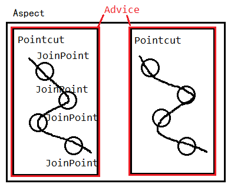
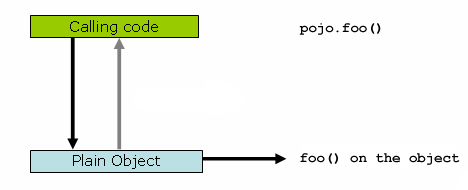
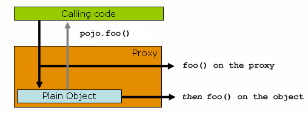
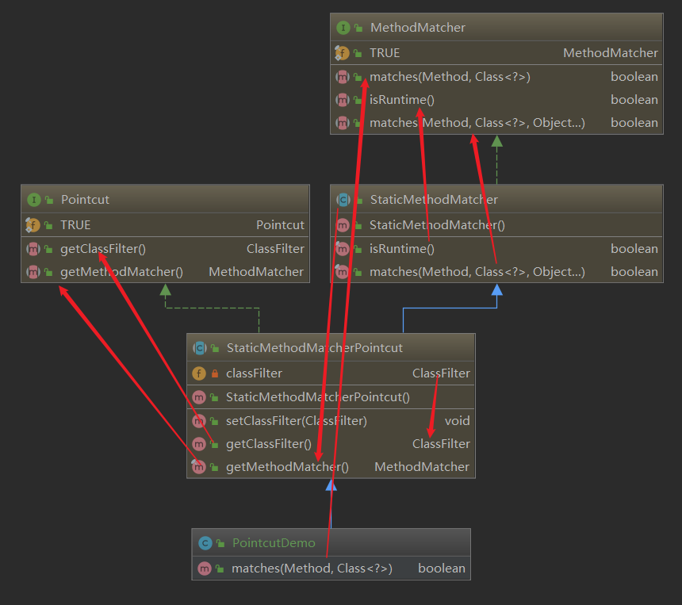

# 一、概念

## 1、AOP Aspect、Join point、Poingcut



## 2、Spring AOP

*  可以通过[schema-based approach](https://docs.spring.io/spring-framework/docs/current/spring-framework-reference/core.html#aop-schema) 或  [@AspectJ annotation style](https://docs.spring.io/spring-framework/docs/current/spring-framework-reference/core.html#aop-ataspectj)进行使用

> [@AspectJ or XML for Spring AOP?](https://docs.spring.io/spring-framework/docs/current/spring-framework-reference/core.html#aop-ataspectj-or-xml)
>
> XML: a good test is whether you consider the pointcut expression to be a part of your configuration that you might want to change independently. 
>
> @AspectJ: ①there should be a single, unambiguous, authoritative representation of any piece of knowledge within a system. ②The @AspectJ style supports additional instantiation models and richer pointcut composition. 

* Field interception is not implemented。不对字段进行增强。

>  The aim is not to provide the most complete AOP implementation (although Spring AOP is quite capable). Rather, the aim is to provide a close integration between AOP implementation and Spring IoC, to help solve common problems in enterprise applications.

* Spring AOP defaults to using standard JDK dynamic proxies for AOP proxies. This enables any interface (or set of interfaces) to be proxied. Spring AOP can also use CGLIB proxies. By default, CGLIB is used if a business object does not implement an interface. 
* Advisor = Pointcut + Advice

## 3、@AspectJ风格

> Spring interprets the same annotations as AspectJ 5, using a library supplied by AspectJ for pointcut parsing and matching. The AOP runtime is still pure Spring AOP, though, and there is no dependency on the AspectJ compiler or weaver.

### ⑴、使用步骤

#### ⅰ. 打开 @AspectJ 支持

```java
@Configuration
@EnableAspectJAutoProxy
public class AppConfig {

}
```

**or**

```xml
<aop:aspectj-autoproxy/>
```

#### ⅱ. Declaring an Aspect

```java
@Component
@Aspect
public class Aspect {

}
```

**or**

```java
@Aspect
public class Aspect {

}
```

```xml
<bean id="aspect" class="Aspect"/>
```

> Advising aspects with other aspects?
>
> In Spring AOP, aspects themselves cannot be the targets of advice from other aspects. The `@Aspect` annotation on a class marks it as an aspect and, hence, excludes it from auto-proxying.

#### ⅲ. Declaring a Pointcut

```java
@Pointcut("execution(* transfer(..))") // the pointcut expression
private void pointcut() {} // the pointcut signature
```

#### ⅳ. Declaring Advice

```java
@Around("pointcut()")
public void aroundAdvice(){
	//to do something
}
```

### ⑵、Pointcut Designators

> 语法解释用到了aspectj，而实现spring aop。

#### ⅰ.execution

> For matching method execution join points. 

```
 execution(modifiers-pattern? 权限
             ret-type-pattern 返回类型
             declaring-type-pattern? 声明类型
             name-pattern(param-pattern) 方法名
             throws-pattern?) 异常
```

> param-pattern：
>
> `()` matches a method that takes no parameters, whereas `(..)` matches any number (zero or more) of parameters. 
> The `(*)` pattern matches a method that takes one parameter of any type. 
> `(*,String)` matches a method that takes two parameters. The first can be of any type, while the second must be a `String. 

- The execution of any public method:

  ```
  execution(public * *(..))
  ```

- The execution of any method with a name that begins with `set`:

  ```
  execution(* set*(..))
  ```

- The execution of any method defined by the `AccountService` interface:

  ```
  execution(* com.xyz.service.AccountService.*(..))
  ```

- The execution of any method defined in the `service` package:

  ```
  execution(* com.xyz.service.*.*(..))
  ```

- The execution of any method defined in the service package or one of its sub-packages:

  ```
  execution(* com.xyz.service..*.*(..))
  ```

#### ⅱ.bean(idOrNameOfBean)

```java
 @Pointcut("bean(beanname*)")
```

> The bean PCD is supported only in Spring AOP. 

#### ⅲ.within

> Limits matching to join points within certain types. 

- Any join point (method execution only in Spring AOP) within the service package:

  ```
      within(com.xyz.service.*)
  ```

- Any join point (method execution only in Spring AOP) within the service package or one of its sub-packages:

  ```
      within(com.xyz.service..*)
  ```

#### ⅳ.target

>  Limits matching to join points (the execution of methods when using Spring AOP) where the target object (application object being proxied) is an instance of the given type.

* Any join point (method execution only in Spring AOP) where the target object implements the `Xxx` interface:

```
    target(Xxx)
```

#### ⅴ.this

> Limits matching to join points (the execution of methods when using Spring AOP) where the bean reference (Spring AOP proxy) is an instance of the given type.

* Any join point (method execution only in Spring AOP) where the proxy implements the `Xxx` interface:

```
    this(Xxx)
```

> Spring AOP is a proxy-based system and differentiates between the proxy object itself (which is bound to `this`) and the target object behind the proxy (which is bound to `target`).

#### Pointcut Designators Tips

* execution较常用
* bean 关注对象，而within关注类型
* @annotation、@within等利用注解进行切点描述，@annotation关注方法、@within关注类型。
* this和target的使用设计到更多知识(待学习)

#### Combining Pointcut Expressions

> You can combine pointcut expressions by using `&&,` `||` and `!`. You can also refer to pointcut expressions by name. 

```java
@Pointcut("@within(XXX)")
private void pointcut(){

}

@Pointcut("@annotation(XXX)")
private void pointcut01(){

}
//当符合两个切点面定义时，执行下面的方法。
@Pointcut("pointcut() && pointcut01()")
private void combiningPointcut(){}
```

> It is a best practice to build more complex pointcut expressions out of smaller named components. 
### ⑶、Declaring Advice

* **@Before()**，方法执行前。
* **@AfterReturning()**，方法成功返回结果后。
* **@AfterThrowing()**，方法遇异常退出后。
* **@After()**，方法退出后（无论时正常退出还是异常退出）。
* **@Around()**，环绕增强

> 每一个增强方法都有一个JoinPoint对象作为参数。JoinPoint方法：
>
> - `getArgs()`: Returns the method arguments.
> - `getThis()`: Returns the proxy object.
> - `getTarget()`: Returns the target object.
> - `getSignature()`: Returns a description of the method that is being advised.
> - `toString()`: Prints a useful description of the method being advised.
>
> 环绕增强用ProceedingJoinPoint对象代替JoinPoint对象，使其为参数。

#### Tips：

* **@After()**会比**@AfterReturning()**先执行。
* **@AfterThrowing()**并不能把异常捕获。
* 不同切面对同一连接点的增强顺序，可以通过@Order指定切面的优先级；同一切面只能通过合并或者将连接点分到不同切面，进行优先级设置。[更多](https://docs.spring.io/spring-framework/docs/current/spring-framework-reference/core.html#aop-ataspectj-advice-ordering)

### ⑷、其他

**Introduce**、**Aspect Instantiation Models**

## 4、Spring AOP 的代理机制

[文档](https://docs.spring.io/spring-framework/docs/current/spring-framework-reference/core.html#aop-proxying)

> JDK代理：只会代理接口的方法；CGLIB代理：代理protect和public方法；

Spring AOP 的代理机制如下





这将导致自调用问题，最好的解决办法是重构代码。

# 二、Spring AOP APIs

## 1、Pointcut API

### Spring AOP APIs，Pointcut接口

```java
public interface Pointcut {

    ClassFilter getClassFilter();

    MethodMatcher getMethodMatcher();

}
public interface ClassFilter {

    boolean matches(Class clazz);
}
public interface MethodMatcher {

    boolean matches(Method m, Class targetClass);

    boolean isRuntime();

    boolean matches(Method m, Class targetClass, Object[] args);
}
```

> The `ClassFilter` interface is used to restrict the pointcut to a given set of target classes. 
>
> ClassFilter接口用于过滤需要PointCut需要增强的类。
>
> The `matches(Method, Class)` method is used to test whether this pointcut ever matches a given method on a target class. 
>
> MethodMatcher用于过滤target类中需要advice的方法。
>
> 若`boolean matches(Method m, Class targetClass)` 和` boolean isRuntime()`返回`true`，` boolean matches(Method m, Class targetClass, Object[] args)`将执行。第三个方法的作用是：
>
> This lets a pointcut look at the arguments passed to the method invocation immediately before the target advice is to execute.
>
> 在每次对target 对象 advice时，pointcut会对方法的参数进行一次拦截。
>
> 许多的MethodMatcher实现是静态的，意味着`isRuntime()`的返回值为false。

### Spring pointcuts 间支持 `!`、`||` 和 `&&` 操作。

>   You can compose pointcuts by using the static methods in the `org.springframework.aop.support.Pointcuts` class or by using the `ComposablePointcut` class in the same package.

### Spring 提供的 pointcut 实现

* Regular Expression Pointcuts，`org.springframework.aop.support.JdkRegexpMethodPointcut`

>  属于Static Pointcuts。Static Pointcuts 基于类和方法，不参考参数。对第一调用pointcut后，就不需要在evaluate 。
>
> Using `RegexpMethodPointcutAdvisor` simplifies wiring. 
>
> Advisor = Pointcut + Advice

* Control Flow Pointcuts

> 属于Dynamic pointcuts。Dynamic pointcuts运行时成本高。

* AspectJExpressionPointcut

> Since 2.0, the most important type of pointcut used by Spring is `org.springframework.aop.aspectj.AspectJExpressionPointcut`. This is a pointcut that uses an AspectJ-supplied library to parse an AspectJ pointcut expression string. 

### 自定义pointcut

> 继承`StaticMethodMatcherPointcut`，

```java
class TestStaticPointcut extends StaticMethodMatcherPointcut {

    public boolean matches(Method m, Class targetClass) {
        // return true if custom criteria match
    }
}
```



## 2、Advice API

### Each advice is a Spring bean. 

> per-class or per-instance advice. 

### Advice Types

* ##### Around Advice，自定义一个环绕增强，实现下接口：

```java
public interface MethodInterceptor extends Interceptor {

    Object invoke(MethodInvocation invocation) throws Throwable;
}
```

> The `MethodInvocation` argument to the `invoke()` method exposes the method being invoked, the target join point, the AOP proxy, and the arguments to the method. The `invoke()` method should return the invocation’s result: the return value of the join point.

```java
public class TestInterceptor implements MethodInterceptor {
    @Override
    public Object invoke(MethodInvocation invocation) throws Throwable {
        //对象获取
        final Object target = invocation.getThis();
        //方法执行， This proceeds down the interceptor chain towards the join point. Most interceptors invoke this method and return its return value.
        final Object result = invocation.proceed();
        return null;
    }
}
```

* **BeforeAdvice，自定义一个前置增强，实现MethodBeforeAdvice接口**：

```java
public interface MethodBeforeAdvice extends BeforeAdvice {

    void before(Method m, Object[] args, Object target) throws Throwable;
}
```

* **Throws advice，自定义一个异常增强，需要实现ThrowsAdvice接口，但是接口没有任务方法，仅仅起标志作用而已。实现类至少需要声明以下方法中的一个：**

```java
void afterThrowing([Method, args, target], subclassOfThrowable) [throws Throwable];
```

* **After returning Advice，自定义一个返回增强，实现AfterReturningAdvice接口：**

```java
public interface AfterReturningAdvice extends Advice {
    void afterReturning(Object returnValue, Method m, Object[] args, Object target)
            throws Throwable;
}
```

* **Interception Advice，对target对象接上一个或多个接口，从而对target进行增强。**

> [文档](https://docs.spring.io/spring-framework/docs/current/spring-framework-reference/core.html#aop-api-advice-introduction)

## 3、Spring提供的其他创建代理对象的方式

### ProxyFactoryBean 

> Spring 获取一个代理对象，可以通过使用 `org.springframework.aop.framework.ProxyFactoryBean`。

```java
@Bean("proxy")@Autowired
public Object setProxySteelAxe(Object target) throws ClassNotFoundException {
    //代理工厂。工厂模式：简化对象创建，我们只需要通过设置需要的参数，其他的参数由工厂默认设置。
    ProxyFactoryBean proxyFactoryBean=new ProxyFactoryBean();
    //被代理对象
    proxyFactoryBean.setTarget(target);
    //代理接口
    Class[] clazzes=new Class[]{Inter.class} ;
    proxyFactoryBean.setProxyInterfaces(clazzes);
    //增强器bean名称
    proxyFactoryBean.setInterceptorNames("advice");
    //设置完参数后，getObject()，获取一个代理对象。
    return proxyFactoryBean.getObject();
}
```

### ProxyFactory

```java
public static void main(String[] args) {
    //spring aop ProxyFactory
    //定义一个增强器
    DefaultPointcutAdvisor advisor=new DefaultPointcutAdvisor();
    advisor.setPointcut(new TestPointcut());
    advisor.setAdvice(new TestInterceptor());
    ProxyFactory factory = new ProxyFactory();
    //1、设置被代理对象
    factory.setTarget(new SimplePojo());
    //2、设置接口
    factory.setInterfaces(Pojo.class);
    //3、设置增强器
    factory.addAdvisor(advisor);
    //4、对全部方法设置增强
    factory.addAdvice(new TestBefore());
    //5、获取代理对象
    final Pojo proxy = (Pojo) factory.getProxy();
    proxy.bar();
    System.out.println("-------------------");
    proxy.foo();
}
/*
bar 方法增强
方法增强
对象：cn.yuanyuan.practice10.pojo.SimplePojo@ee7d9f1
方法执行前
bar
-------------------
foo 方法不增强
方法执行前
foo
*/
```

## 4、其他

### 对代理对象进行操作

> 在程序运行时，修改代理对象的增强，可以冻结这种操作。更多：[文档](https://docs.spring.io/spring-framework/docs/current/spring-framework-reference/core.html#aop-api-advised)

```java
Advised advised=(Advised) proxy;
```

### Using the "auto-proxy" facility

[文档](https://docs.spring.io/spring-framework/docs/current/spring-framework-reference/core.html#aop-autoproxy)

