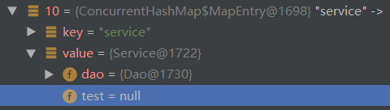

# 一、ioc容器简介

## 1、继承图


## 2、BeanFactory和ApplicationContext

[博客链接](https://blog.csdn.net/u010871004/article/details/53589642?depth_1-utm_source=distribute.pc_relevant.none-task&utm_source=distribute.pc_relevant.none-task)

### ①BeanFactory和ApplicationContext联系
BeanFactory和ApplicationContext是Spring的两大核心接口，而其中ApplicationContext是BeanFactory的子接口。它们都可以当做Spring的容器，Spring容器是生成Bean实例的工厂，并管理容器中的Bean。在基于Spring的Java EE应用中，所有的组件都被当成Bean处理，包括数据源，Hibernate的SessionFactory、事务管理器等。
Spring容器最基本的接口就是BeanFactory。BeanFactory负责配置、创建、管理Bean，它有一个子接口ApplicationContext，也被称为Spring上下文，容器同时还管理着Bean和Bean之间的依赖关系。

### ②BeanFactory和ApplicationContext区别
#### BeanFactory特点
BeanFactory常用的实现类是DefaultListableBeanFactory，调用者只需要使用getBean()方法就可以获得指定的引用，无须关心Bean的实例化过程。创建Spring容器的实例时，必须提供Spring容器管理的Bean的详细配置信息。Spring的配置信息通常采用XML配置文件来设置，因此，创建BeanFactory实例时，应该提供XML配置文件作为参数。XML配置文件通常使用Resource对象传入。

```java
public class TestBeanFactory {
    public static void main(String[] args) {
        Resource isr = new ClassPathResource("xxx.xml");
        //Resource isr = new FileSystemResource("xxx.xml");
        DefaultListableBeanFactory beanFactory = new DefaultListableBeanFactory();
        new XmlBeanDefinitionReader(beanFactory).loadBeanDefinitions(isr);
        Object object = beanFactory.getBean("xxx");
        System.out.println(object);
    }
}
```

* ListableBeanFactory 接口表示这些 Bean 是可列表的
* HierarchicalBeanFactory 表示的是这些 Bean 是有继承关系的，也就是每个Bean 有可能有父 Bean。
* AutowireCapableBeanFactory 接口定义 Bean 的自动装配规则。

#### ApplicationContext特点
ApplicationContext常用的实现类是FileSystemXmlApplicationContext、ClassPathXmlApplicationContext和AnnotationConfigApplicationContext。如果在Web应用中使用Spring容器，则通常使用XmlWebApplicationContext、AnnotationConfigApplicationContext两个实现类。如果需要使用多个XML配置文件创建Spring容器，可以使用FileSystemXmlApplicationContext或者是ClassPathXmlApplicationContext。
除了提供BeanFactory所支持的所有功能外，ApplicationContext还有额外的功能

* 默认初始化所有的Singleton，也可以通过配置取消预初始化。

* 继承MessageSource，因此支持国际化。

* 资源访问，比如访问URL和文件。

* 事件机制。

* 同时加载多个配置文件。

* 以声明式方式启动并创建Spring容器。

> 由于ApplicationContext会预先初始化所有的Singleton Bean，于是在系统创建前期会有较大的系统开销，但一旦ApplicationContext初始化完成，程序后面获取Singleton Bean实例时候将有较好的性能。也可以为bean设置lazy-init属性为true，即Spring容器将不会预先初始化该bean。

# 二、ioc容器相关知识点

## 1、BeanFactory

### ①BeanFactory接口的一些方法

```java
public interface BeanFactory {
	/**
	 * 如果没有指定名称的bean，则抛出NoSuchBeanDefinitionException
	 * 在无法获得bean时抛出BeansException
	 * 这里根据bean的名字，在IOC容器中得到bean实例，这个IOC容器就是一个大的抽象工厂。
	 */
	Object getBean(String name) throws BeansException;

	/**
	 * 允许指定显式构造函数参数/工厂方法参数，
	 * 覆盖bean定义中指定的默认参数(如果有的话)。
	 * 如果没有这样的bean定义，@抛出NoSuchBeanDefinitionException
	 * @抛出BeanDefinitionStoreException如果参数已经给定，但是受影响的bean不是原型
	 * 如果不能创建bean， @抛出BeansException 
	 */
	Object getBean(String name, Object... args) throws BeansException;

	/**
	 * 这个bean工厂是否包含一个bean定义。
	 */
	boolean containsBean(String name);

	/**
	 * bean是否是共享单例
	 */
	boolean isSingleton(String name) throws NoSuchBeanDefinitionException;

	/**
	 * bean是否是多例
	 */
	boolean isPrototype(String name) throws NoSuchBeanDefinitionException;

	/**
	 * 这里得到bean的别名，如果根据别名检索，那么其原名也会被检索出来
	 */
	String[] getAliases(String name);
}
```

### ②getBean()分析

> bean定义：有着完整生命周期的对象。

```java
protected <T> T doGetBean(final String name, @Nullable final Class<T> requiredType,
      @Nullable final Object[] args, boolean typeCheckOnly) throws BeansException {
    // 解析别名
    String beanName = transformedBeanName(name);
    // *** 尝试去单例池singletonObjects获取对象,
    Object sharedInstance = getSingleton(beanName);
    if (sharedInstance != null && args == null) {
    }else {
        //获取beandefinition
        RootBeanDefinition mbd = getMergedLocalBeanDefinition(beanName);
        //判断依赖
        String[] dependsOn = mbd.getDependsOn();
        // 与上面的getSingleton()作用不同，这里是实例化Bean对象
        if (mbd.isSingleton()) {
            sharedInstance = getSingleton(beanName, () -> {
				return createBean(beanName, mbd, args);
            });
        }
    }
    //创建对象，
    /*
    * getSingleton(String beanName, ObjectFactory<?> singletonFactory):
    * //解决循环依赖
    * Object singletonObject = this.singletonObjects.get(beanName);
    * if(singletonObject==null){
    * 	  //createBean()
    * }
    * ===================================================================
    * createBean(String beanName, RootBeanDefinition mbd, Object[] args):
    * //处理lookup-method和replace-method配置
    * mbdToUse.prepareMethodOverrides();
    * //第一次后置处理器
    * Object bean = resolveBeforeInstantiation(beanName, mbdToUse);
    * Object beanInstance = doCreateBean(beanName, mbdToUse, args);
    * ====================================================================
    * doCreateBean(String beanName, RootBeanDefinition mbd,Object[] args):
    * //调用构造方法，第二次，仅仅new出一个对象，还不是bean，此时singletonObjects中还没有bean
    * instanceWrapper = createBeanInstance(beanName, mbd, args);
    * //进行后置处理器，@AutoWired的注解的预解析。第三次缓存bean的信息。
    * applyMergedBeanDefinitionPostProcessors(mbd, beanType, beanName);
    * //第四次，解决循环依赖，将对象放到earl池中。
    * addSingletonFactory(beanName, () -> getEarlyBeanReference(beanName, mbd, bean));
    * //注入，调用set方法，第五次，第六次
    * //new出来后，填充属性，再执行bean的初始化方法。
    * populateBean(beanName, mbd, instanceWrapper);
    * //第七次、第八调用后置处理器，处理aop
    * exposedObject = initializeBean(beanName, exposedObject, mbd);
    */
}
```

```shell
#九个bean核心后置处理器
InstantiationAwareBeanPostProcessor#postProcessBeforeInstantiation
#推断构造函数
SmartInstantiationAwareBeanPostProcessor#determineCandidateConstructors
#@AutoWired的注解的预解析。第三次缓存
MergedBeanDefinitionPostProcessor#postProcessMergedBeanDefinition
#第四次，解决循环依赖，将对象放到early池中。
SmartInstantiationAwareBeanPostProcessor#getEarlyBeanReference
#第五次，判断后面要不要填充属性
InstantiationAwareBeanPostProcessor#postProcessAfterInstantiation
#第六次，自动装配自动注入
InstantiationAwareBeanPostProcessor#postProcessPropertyValues
#第七次、第八调用后置处理器，处理aop
BeanPostProcessor#postProcessBeforeInitialization
BeanPostProcessor#postProcessAfterInitialization
```

## 2、BeanDefinition

定义：**spring描述bean对象的对象。**

### ①场景

将定义的非单例bean，通过修改BeanDefinition改为单例Bean

目录结构：


代码：

```java
package cn.yuanyuan.app;
public class App {
    public static void main(String[] args) {
        AnnotationConfigApplicationContext applicationContext=new AnnotationConfigApplicationContext("cn.yuanyuan");
        final Service bean = applicationContext.getBean(Service.class);
    }
}

package cn.yuanyuan.bean;
@Component
public class Dao {
}
@Component
@Scope("prototype")
public class Service {

    @Autowired
    Dao dao;

}

package cn.yuanyuan.postprocessor;
@Component
public class YuanBeanFactoryPostProcessor implements BeanFactoryPostProcessor {
    @Override
    public void postProcessBeanFactory(ConfigurableListableBeanFactory beanFactory) throws BeansException {
        final GenericBeanDefinition beanDefinition = (GenericBeanDefinition) beanFactory.getBeanDefinition("service");
        beanDefinition.setScope("singleton");
    }
}
```

实验结果：


## 3、Spring环境初始化

```java
ApplicationContext applicationContext = new ClassPathXmlApplicationContext("xxx.xml");
```

```java
public class AnnotationConfigApplicationContext extends GenericApplicationContext implements AnnotationConfigRegistry {
    /*
    public GenericApplicationContext() {
    	//bean容器
		this.beanFactory = new DefaultListableBeanFactory();
	}
    */
	public AnnotationConfigApplicationContext() {
        //注解模式下的bean定义扫描器
		this.reader = new AnnotatedBeanDefinitionReader(this);
        //classPath类型的bean定义扫描器
		this.scanner = new ClassPathBeanDefinitionScanner(this);
	}
	public AnnotationConfigApplicationContext(Class<?>... componentClasses) {
		this();
        //注册配置类
		register(componentClasses);
        //容器初始化
		refresh();
	}
}
```

```java
public void refresh() throws BeansException, IllegalStateException {
    synchronized (this.startupShutdownMonitor) {
        // Prepare this context for refreshing.
        prepareRefresh();

        // Tell the subclass to refresh the internal bean factory.
        ConfigurableListableBeanFactory beanFactory = obtainFreshBeanFactory();

        // Prepare the bean factory for use in this context.
        prepareBeanFactory(beanFactory);

        try {
            // Allows post-processing of the bean factory in context subclasses.
            postProcessBeanFactory(beanFactory);
            //执行当前项目所有的BeanFactoryPostProcessors
            //bean 实例化之前 扫描要实例化的bean，将它们的BeanDefinition放Map中。
            //bean 五处扩展点之一
            invokeBeanFactoryPostProcessors(beanFactory);
            // *调用bean的后置处理器，
            registerBeanPostProcessors(beanFactory);
            // 初始化
            initMessageSource();
            // 创建时间多播器
            initApplicationEventMulticaster();
            // 留给子类
            onRefresh();
            // 时间注册道多播器上
            registerListeners();
            // *bean实例化
            /*
            beanFactory.preInstantiateSingletons();实例所有的单例对象
            for (String beanName : beanNames) {
            	getBean(beanName);
            }
            */
            finishBeanFactoryInitialization(beanFactory);
            
            finishRefresh();
        }
        catch (BeansException ex) {
            // 销毁
            destroyBeans();
        }
    }
}
```

## 4、注入

### ①注入技术

```java
//根据类型获取Bean
AUTOWIRE_BY_TYPE;
//根据名字获取Bean
AUTOWIRE_BY_NAME;
```

### ②注入方法

```java
//注解
int AUTOWIRE_NO = 0;
//根据set方法的属性名
int AUTOWIRE_BY_NAME = 1;
//根据构造函数
int AUTOWIRE_CONSTRUCTOR = 3;
//其他
```

### ③注解场景

在bean的成员变量上贴上`AutoWired`，执行空参方法，set方法也不产生作用。

目录结构：


代码：

```java
package cn.yuanyuan.app;
public class App {
    public static void main(String[] args) {
        AnnotationConfigApplicationContext applicationContext=new AnnotationConfigApplicationContext(cn.yuanyuan.practice07.bean,"cn.yuanyuan.postprocessor");
        final Service bean = applicationContext.getBean(Service.class);
        applicationContext.close();
    }
}

package cn.yuanyuan.bean;
@Component
public class Test {
}
@Component
public class Dao {
}
@Component
public class Service {

    @Autowired
    Dao dao;

    Test test;

    public Service(){
        System.out.println("构造函数1");
    }
    public Service(Test test){
        System.out.println("构造函数2");
        this.test=test;
    }
    public void setTest(Test test){
        System.out.println("set方法");
        this.test=test;
    }
}

package cn.yuanyuan.postprocessor;
@Component
public class YuanBeanFactoryPostProcessor implements BeanFactoryPostProcessor {
    @Override
    public void postProcessBeanFactory(ConfigurableListableBeanFactory beanFactory) throws BeansException {
        final GenericBeanDefinition beanDefinition = (GenericBeanDefinition) beanFactory.getBeanDefinition("service");
        System.out.println(beanDefinition.getAutowireMode());
    }
}

```

实验结果：




### ④set方法场景

将`service`的`BeanDefinition`的`AutowireMode`设为1，构造函数执行空参，set方法进行成员注入。

目录结构：


代码：

```java
package cn.yuanyuan.bean;
@Component
public class Service {

    Dao dao;

    Test test;

    public Service(){
        System.out.println("构造函数1");
    }
    public Service(Test test){
        System.out.println("构造函数2");
        this.test=test;
    }
    public Service(Test test,Dao dao){
        System.out.println("构造函数3");
        this.test=test;
        this.dao=dao;
    }

    public void setTest(Test test){
        System.out.println("set方法");
        this.test=test;
    }
}

package cn.yuanyuan.postprocessor;
@Component
public class YuanBeanFactoryPostProcessor implements BeanFactoryPostProcessor {
    @Override
    public void postProcessBeanFactory(ConfigurableListableBeanFactory beanFactory) throws BeansException {
        final GenericBeanDefinition beanDefinition = (GenericBeanDefinition) beanFactory.getBeanDefinition("service");
        beanDefinition.setAutowireMode(1);
        System.out.println(beanDefinition.getAutowireMode());
    }
}
```

实验结果：


### ⑤构造函数场景

将`service`的`BeanDefinition`的`AutowireMode`设为1，构造函数执行第二个，set方法不进行成员注入。

目录结构：


代码：

```java
package cn.yuanyuan.bean;
@Component
public class Service {

    Dao dao;

    Test test;

    public Service(){
        System.out.println("构造函数1");
    }
    public Service(Dao dao){
        System.out.println("构造函数2");
        this.dao=dao;
    }

    public void setTest(Test test){
        System.out.println("set方法");
        this.test=test;
    }
}

package cn.yuanyuan.postprocessor;
@Component
public class YuanBeanFactoryPostProcessor implements BeanFactoryPostProcessor {
    @Override
    public void postProcessBeanFactory(ConfigurableListableBeanFactory beanFactory) throws BeansException {
        final GenericBeanDefinition beanDefinition = (GenericBeanDefinition) beanFactory.getBeanDefinition("service");
        beanDefinition.setAutowireMode(3);
        System.out.println(beanDefinition.getAutowireMode());
    }
}
```

实验结果：


## 5、将对象交给Spring管理的方法

基于以上理解，如何将**一个自己创建的对象交给Spring管理**

### ①@Bean

目录：


代码：

```java
package cn.yuanyuan.app;
public class App {
    public static void main(String[] args) {
        AnnotationConfigApplicationContext applicationContext=new AnnotationConfigApplicationContext(MyConfig.class);
        final Dao dao = (Dao) applicationContext.getBean(Dao.class);
        System.out.println("App:"+dao);
        dao.query();
        applicationContext.close();
    }
}

package cn.yuanyuan.config;
@ComponentScan({"cn.yuanyuan.bean","cn.yuanyuan.postprocessor"})
public class MyConfig {
    @Bean
    public Dao dao(){
        Dao dao=new Dao();
        System.out.println("MyConfig"+dao);
        return dao;
    }
}

package cn.yuanyuan.bean;
public class Dao {
    @Autowired
    Test test;
    public void query(){
        System.out.println("查询");
    }
}
@Component
public class Test {
}

package cn.yuanyuan.handler;
public class DaoInvocationHandle implements InvocationHandler {
    @Override
    public Object invoke(Object proxy, Method method, Object[] args) throws Throwable {
        System.out.println("代理Dao接口");
        return null;
    }
}
```

实验结果：


> 批注：@Bean函数生成的对象在BeanFactory中还是有BeanDefinition描述，标注的函数在第二个后置处理器执行，所以他会经历后面的注入过程。

### ②BeanFactory().registerSingleton("xxx",xxx);

目录：


代码：

```java
public class App {
    public static void main(String[] args) {
        AnnotationConfigApplicationContext applicationContext=new AnnotationConfigApplicationContext(MyConfig.class);
        final Dao dao = new Dao();
        System.out.println("放入前"+dao);
        applicationContext.getBeanFactory().registerSingleton("dao",dao);
        System.out.println("放入后"+applicationContext.getBean(Dao.class));
    }
}

public class Dao {
    @Autowired
    Test test;
}
@Component
public class Test {
}

@ComponentScan({"cn.yuanyuan.bean"})
public class MyConfig {
}
```

实验结果：


> 此方法缺点非常明显，完全没利用到Spring的Bean依赖解决，dao中test成员为null。

### ③FactoryBean

目录：


代码：

```java
public class App {
    public static void main(String[] args) {
       AnnotationConfigApplicationContext applicationContext=new AnnotationConfigApplicationContext(MyConfig.class);
        final Dao dao = applicationContext.getBean(Dao.class);
        System.out.println("App:"+dao);
    }
}

@Component
public class DaoFactory implements FactoryBean {

    private Dao dao=new Dao();

    @Override
    public Object getObject() throws Exception {
        System.out.println("DaoFactory:"+dao);
        return dao;
    }

    @Override
    public Class<?> getObjectType() {
        return Dao.class;
    }

    @Override
    public boolean isSingleton() {
        return true;
    }
}
public class Dao {
    @Autowired
    Test test;

    public void query(){
        System.out.println("查询");
    }
}
@Component
public class Test {
}

@ComponentScan({"cn.yuanyuan.bean"})
public class MyConfig {
}
```

实验结果：


### ④仿MyBaits生成Mapper，加入Spring容器

**注：例子还是有很多未解之谜**

目录：


代码：

```java
public class App {
    public static void main(String[] args) {
       AnnotationConfigApplicationContext applicationContext=new AnnotationConfigApplicationContext(MyConfig.class);
       ((Dao)applicationContext.getBean(Dao.class)).query();
    }
}

public interface Dao {
    void query();
}

@Retention(RetentionPolicy.RUNTIME)
@Import(ImportBeanDefinitionRegistrat.class)
public @interface IMapperScan {
}

public class ImportBeanDefinitionRegistrat implements ImportBeanDefinitionRegistrar {
    @Override
    public void registerBeanDefinitions(AnnotationMetadata importingClassMetadata, BeanDefinitionRegistry registry) {
        //mapper包下所有类，将其用工厂生产出来，并注册到spring容器中
        //for 假设只有一个Dao接口
        final BeanDefinitionBuilder builder = BeanDefinitionBuilder.genericBeanDefinition(MapperFactory.class);
        final GenericBeanDefinition beanDefinition = (GenericBeanDefinition) builder.getBeanDefinition();
        //构造函数注入
        beanDefinition.setAutowireMode(3);
        //添加构造函数值
        beanDefinition.getConstructorArgumentValues().addGenericArgumentValue("cn.yuanyuan.practice07.bean.Dao");
        //将beanDefinition注册到spring容器中
        registry.registerBeanDefinition("dao",beanDefinition);
    }
}

@Component
public class MapperFactory implements FactoryBean {

    Class mapperInterface;

    public MapperFactory(){
        System.out.println("不带参构造函数");
    }

    /**
     * 第二种方式，包扫描
     * @param mapperInterface
     */
    public MapperFactory(Class mapperInterface){
        this.mapperInterface=mapperInterface;
        System.out.println("带参构造函数");
    }

    @Override
    public Object getObject() {
        Class[] clazzs=new Class[]{mapperInterface};
        final Object o = Proxy.newProxyInstance(MapperFactory.class.getClassLoader(), clazzs,
                new MapperInvocationHandle());
        return o;
    }

    @Override
    public Class<?> getObjectType() {
        return mapperInterface;
    }

    @Override
    public boolean isSingleton() {
        return false;
    }

    /**
     * 第一种方式，通过xml
    <bean id="userMapper" class="org.mybatis.spring.mapper.MapperFactoryBean">
      <property name="mapperInterface" value="org.mybatis.spring.sample.mapper.UserMapper" />
      <property name="sqlSessionFactory" ref="sqlSessionFactory" />
    </bean>
    */
    public void setMapperInterface(Class mapperInterface){
        this.mapperInterface=mapperInterface;
    }

}

@ComponentScan({"cn.yuanyuan.practice07"})
@IMapperScan
@Configuration
public class MyConfig {
}

public class MapperInvocationHandle implements InvocationHandler {
    @Override
    public Object invoke(Object proxy, Method method, Object[] args) throws Throwable {
        System.out.println("代理Dao接口");
        return null;
    }
}
```

实验结果：


# 附

需要学习：循环依赖

[spring配置注解context:annotation-config和context:component-scan区别](https://blog.csdn.net/fox_bert/article/details/80793030)

[博客1](https://blog.csdn.net/qq_32651225/article/details/78323527?depth_1-utm_source=distribute.pc_relevant.none-task&utm_source=distribute.pc_relevant.none-task)


